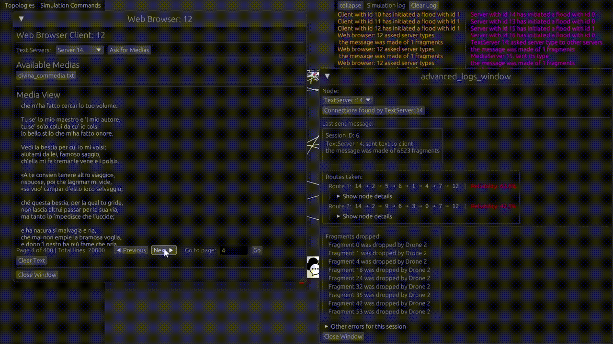

# 🚁 Rolling Drones

> *A multi-threaded distributed systems simulator where packets fly through virtual skies*

## 🌐 Overview

Welcome to a cutting-edge simulation environment with **clients**, **servers**, and **drones**. This project demonstrates the power of Rust's threading model combined with real-time visualization to create a robust network topology simulator.

## 🚀 Quick Start

```bash
# Recommended way to run (optimized performance)
cargo run --release
```

Deploy a chat ecosystem:
- 💬 **3 ChatClients** (individual threads)
- 🗨️ **1 ChatServer** facilitating real-time communication
- Perfect for testing concurrent message handling

## 🎯 Features & Topologies

### `--features max`
```bash
# Run with max feature and default topology
cargo run --release --features max
```
High-performance servers:
- 🔧 Default servers by **@X-baia**
- 🚀 Optional servers by **@malchioman** to have TextServers combined with MediaServers!

### `--features web`
```bash
# Run with web topology
cargo run --release --features web
```
Spin up a web services topology:
- 🌐 **1 Web Browser** client by **@chiarastrozzii**
- 📄 **1 TextServer** - The information point
- 🎬 **2 MediaServers** - Content delivery specialists
- Smart routing: TextServer analyzes requests and directs traffic to the appropriate MediaServer, and should find the best route!
- With '--features web max' you would deploy a network with 3 TextServers that can act also as MediaServers!
```bash
# Run with max feature and web topology
cargo run --release --features "web,max"
```

### `--features full`
```bash
# Run with full topology
cargo run --release --features full
```
**The complete package!** Combines all topologies into one massive simulation:
- All chat components
- All web components
- Maximum concurrency demonstration
```bash
# Run with max feature and full topology
cargo run --release --features "full,max"
```

## 🏗️ Architecture Highlights

### 🧵 **Multi-Threading Mastery**
Every component runs in its own thread:
- **Clients**: Independent request generators
- **Servers**: Concurrent request handlers
- **Drones**: The packet delivery workforce
- **Simulation Controller**: The omniscient orchestrator

### 📡 **Communication Infrastructure**
- **crossbeam_channel**: High-performance message passing
- **Drone Network**: Virtual packet carriers threading through the topology
- **RwLock**: Ensures thread-safe synchronization between the Simulation Controller and GUI

### 🎮 **Simulation Controller**
- 🗺️ Maintains complete topology knowledge
- 📊 Tracks every packet in flight
- 🔄 Bridges backend simulation with frontend visualization
- 🔒 Thread-safe data sharing via `RwLock`
- **@giorebecchi**

### 🎨 **Real-Time Visualization**
Powered by:
- **Bevy**: High-performance game engine for smooth rendering
- **bevy_egui**: Immediate mode GUI for statistics and controls
- Watch packets fly through your network in real-time!

## 💡 Why This Project?

This simulator pushes Rust's concurrency model to its limits while providing visual feedback of complex distributed systems behavior. Perfect for:
- Understanding distributed systems concepts
- Learning concurrent programming patterns
- Visualizing network topology behavior

## 👀 Check out our Demo!


---

*Built with 🦀 Rust | Visualized with 🎮 Bevy*
